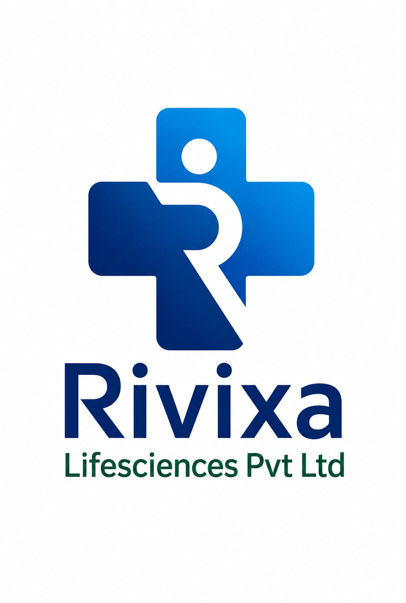

  

  # Rivixa Lifesciences

  **Science with purpose. Care with heart.**

  The digital presence of Rivixa Lifesciences Private Limited.

  **Gynaecology · Ophthalmology · Orthopedic**

  
  
  
  

---

## Purpose

A focused corporate healthcare experience connecting healthcare professionals and prospective partners with Rivixa’s therapeutic areas, company information and team.

## Experience

- Dedicated Gynaecology, Ophthalmology and Orthopedic pages.
- Permanent frontend catalogue with 146 sourced product records, search, group and brand filters, and product enquiries. See [catalogue data notes](frontend/CATALOGUE.md).
- Company profile, guiding principles and Mumbai and Lucknow office information.
- Professional enquiry flow with specialty selection and a reviewable email draft.
- Responsive navigation, accessible form controls and keyboard support.
- Consistent Manrope typography, locally hosted photography and branded social previews.

## Engineering

| Layer | Foundation |
| --- | --- |
| Web application | Next.js 16 App Router · React 19 · TypeScript |
| Interface | Tailwind CSS 4 · shadcn/ui · Radix primitives |
| Rendering | Server Components and prerendered content; client components for interactions |
| Brand system | Shared design tokens · self-hosted Manrope · responsive imagery |
| Backend foundation | Spring Boot 4 · Java 21, maintained separately |

The web application lives in `frontend/`; the backend foundation lives in `backend/`. The current release operates independently of the backend. Enquiries are prepared locally and sent through the visitor’s email application. No server-side enquiry storage is connected.

From `frontend/`, run `npm run build` to export the complete website into `out/`. Deploy `out/` to a static host. `npm start` previews those files locally on port 3000 (override with `PORT`); `npm run dev` runs the development environment. Catalogue values are bundled from source, with no database or browser persistence.

## Brand & ownership

Developed exclusively for **Rivixa Lifesciences Private Limited**. Company branding and original application materials are reserved for authorised Rivixa use. See [LICENSE](LICENSE).

Third-party software, fonts and imagery remain subject to their respective licences. See [THIRD_PARTY_NOTICES.md](THIRD_PARTY_NOTICES.md).

  <strong>Rivixa Lifesciences Private Limited</strong> 
  Mumbai · Lucknow, India 
  <a href="mailto:rivixalifesciences@gmail.com">rivixalifesciences@gmail.com</a>

